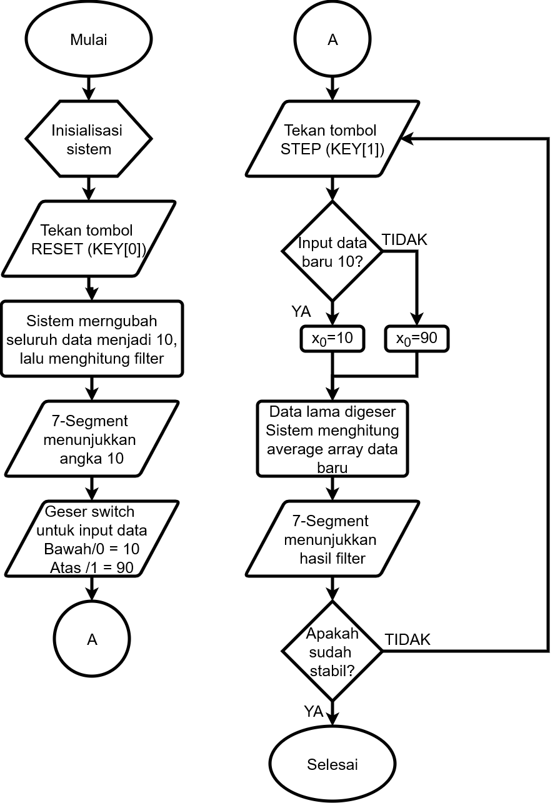
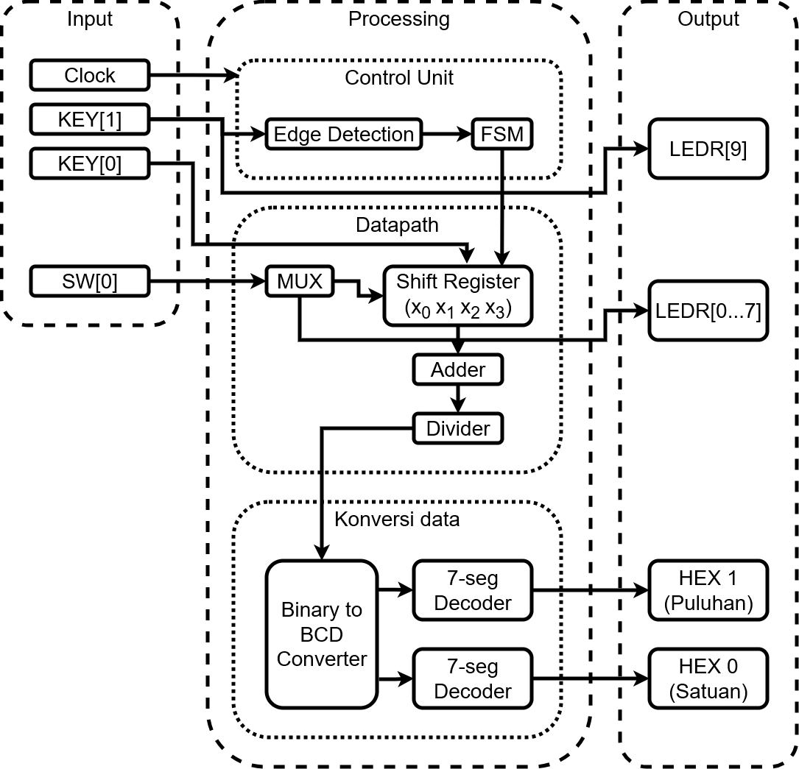
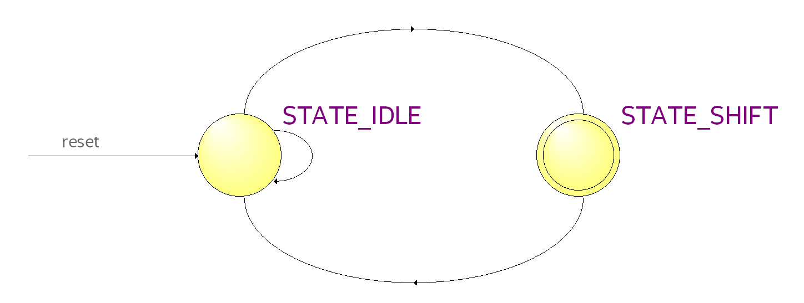

# FPGA-Based FIR Filter Design

## Laporan Tugas Besar  
### Desain FPGA dan SoC 2025

**Kelompok** : 5  

**Nama–NIM Anggota 1** : MUHAMMAD IRFAN ZIDNY / 1102223172  
**Nama–NIM Anggota 2** : FARHAN RUSYDAN ARIEF / 1102223164  
**Nama–NIM Anggota 3** : MOH ELDIVO ALSYAWAL OTOLUWA / 1102223205  

---

## Judul  

**FPGA-BASED FIR FILTER DESIGN**

---

## Deskripsi  

Tugas besar ini merancang sistem pemrosesan sinyal digital berupa Filter FIR (Finite Impulse Response) 4-Tap pada FPGA. Sistem ini mengimplementasikan arsitektur hardware yang dikontrol oleh Finite State Machine (FSM) untuk mengatur aliran data dan operasi aritmatika. FSM bertugas memastikan proses pengambilan sampel data (sampling) dan pergeseran register (shifting) berjalan sinkron dan stabil setiap kali pengguna memberikan perintah step.

---

## Fungsi  

1. **Penyaringan Sinyal**: Meredam perubahan data drastis (noise) menggunakan algoritma Moving Average.  
2. **Kontrol Sekuensial**: Mendemonstrasikan penggunaan State Machine untuk mengatur timing proses digital.  
3. **Visualisasi Data**: Menampilkan hasil filter secara real-time ke 7-Segment Display dalam format desimal.  

---

## Fitur dan Spesifikasi  

### Fitur  

| Fitur | Deskripsi |
|-----|----------|
| 4-Tap Moving Average Algorithm | Mampu meratakan fluktuasi sinyal dengan menghitung rata-rata dari 4 sampel data terakhir |
| Eksekusi sekuensial per step | Mode operasi manual yang memungkinkan pengguna mengamati perubahan data per satu siklus clock |
| Visualisasi 7-Segment | Hasil filter dapat diamati melalui 7 segment |
| Edge detection | Mampu mendeteksi input tombol sebagai trigger input dan pemrosesan data |

---

### Spesifikasi  

1. Platform Hardware: FPGA Altera Cyclone V (DE1-SoC Board).  
2. Clock Frequency: 50 MHz (System Clock).  
3. Controller: Finite State Machine (2-State: IDLE, SHIFT).  
4. Arsitektur Data:  
   - Input 8-bit  
   - Akumulator 10-bit  
   - Output 8-bit  
5. Metode Filter: 4-Tap Moving Average  
   y[n] = (x1+x2+...+x(n-1)+xn)/n
6. Input:  
   - KEY[0]: Reset Asinkron (Active Low).  
   - KEY[1]: Step Trigger (Active Low) dengan Edge Detection.  
   - SW[0]: Selector Input Data (10 atau 90).  

7. Output:  
   - 7-Segment (Nilai Filter)  
   - LEDR[7:0]: Monitor Data Input  
   - LEDR[9]: Button Press Indicator  

---

## Cara Penggunaan  



1. Sistem diaktifkan dengan memberikan catu daya pada board FPGA dan mengunggah program (bitstream).  
2. Sistem melakukan inisialisasi awal saat tombol Reset (KEY[0]) ditekan, mengembalikan seluruh data register dan tampilan ke nilai default (10).  
3. Pengguna menentukan target input dengan menggeser Switch (SW[0]) ke posisi bawah (nilai 10) atau atas (nilai 90).  
4. Lampu indikator LEDR[0–7] menyala seketika untuk memvisualisasikan data biner dari input yang dipilih.  
5. Tombol Step (KEY[1]) ditekan untuk memicu FSM mengambil satu sampel data baru.  
6. Lampu status LEDR[9] menyala sesaat selama tombol Step ditekan.  
7. Sistem memproses data secara internal dan menampilkan hasil rata-rata pada 7-Segment.  
8. Jika belum mencapai steady state, tombol Step ditekan kembali.  
9. Proses berulang hingga output stabil dan sama dengan nilai input.  

---

## Blok Diagram  

Diagram blok dibagi menjadi tiga bagian utama:  

### 1. Blok Input  
- Clock 50 MHz  
- KEY[1] sebagai Step Trigger  
- KEY[0] sebagai Reset  
- SW[0] sebagai selector input  

### 2. Blok Processing  
- Control Unit (Edge Detection & FSM)  
- Datapath (MUX, Shift Register, Adder & Divider)  
- Konversi Data (Binary to BCD & 7-Segment Decoder)  

### 3. Blok Output  
- LEDR[9] indikator tombol  
- LEDR[0–7] indikator data input  
- HEX1 dan HEX0 sebagai display hasil filter  

---

## Finite State Machine (FSM)  


Sistem menggunakan FSM tipe Moore dengan dua state utama:  

- **STATE_IDLE**: Sistem menunggu input, enable datapath nonaktif.  
- **STATE_SHIFT**: FSM mengaktifkan enable datapath untuk satu siklus clock.  

Transisi IDLE → SHIFT dipicu oleh step_trigger dari Edge Detection. Setelah satu siklus clock, FSM kembali ke IDLE untuk mencegah pembacaan ganda.

---

## Hasil Simulasi dan Analisis  

Simulasi dilakukan menggunakan testbench dan ModelSim. Hasil menunjukkan:  

- Reset berhasil menginisialisasi sistem ke nilai 10.  
- Perubahan input SW langsung tercermin di LEDR namun tidak langsung di HEX.  
- Output filter meningkat bertahap: 10 → 30 → 50 → 70 → 90.  

Hal ini membuktikan FSM menahan update data hingga trigger valid dan unit aritmatika bekerja sesuai perancangan sebagai Low Pass Filter.

---

## Lampiran (Kode Verilog)

### `top_system.v`
```verilog
module top_system (
    input CLOCK_50,
    input [3:0] KEY,
    input [9:0] SW,
    output [9:0] LEDR,
    output [6:0] HEX0,
    output [6:0] HEX1
);

    reg key1_prev;
    wire step_trigger;

    always @(posedge CLOCK_50) begin
        key1_prev <= KEY[1];
    end
    assign step_trigger = (key1_prev == 1'b1 && KEY[1] == 1'b0);

    reg [7:0] input_data;
    always @(*) begin
        if (SW[0] == 1'b0) input_data = 8'd10;
        else input_data = 8'd90;
    end

    localparam STATE_IDLE  = 2'd0;
    localparam STATE_SHIFT = 2'd1;

    reg [1:0] current_state, next_state;

    reg [7:0] x0, x1, x2, x3;
    wire [9:0] sum;
    wire [7:0] filter_out;

    always @(posedge CLOCK_50) begin
        if (KEY[0] == 1'b0) begin
            current_state <= STATE_IDLE;
        end else begin
            current_state <= next_state;
        end
    end

    always @(*) begin
        case (current_state)
            STATE_IDLE: begin
                if (step_trigger) 
                    next_state = STATE_SHIFT;
                else 
                    next_state = STATE_IDLE;
            end
            
            STATE_SHIFT: begin
                next_state = STATE_IDLE;
            end
            
            default: next_state = STATE_IDLE;
        endcase
    end

    always @(posedge CLOCK_50) begin
        if (KEY[0] == 1'b0) begin
            x0 <= 8'd10; 
            x1 <= 8'd10;
            x2 <= 8'd10;
            x3 <= 8'd10;
        end else begin
            if (current_state == STATE_SHIFT) begin
                x0 <= input_data; 
                x1 <= x0;          
                x2 <= x1;
                x3 <= x2;
            end
        end
    end

    assign sum = x0 + x1 + x2 + x3;
    assign filter_out = sum[9:2];

    reg [3:0] digit_satuan;
    reg [3:0] digit_puluhan;
    
    always @(*) begin
        digit_satuan  = filter_out % 10; 
        digit_puluhan = filter_out / 10; 
    end

    assign LEDR[7:0] = input_data; 
    
    assign LEDR[9] = ~KEY[1]; 

    seven_segment hex_low (
        .in(digit_satuan), 
        .out(HEX0)
    );
    
    seven_segment hex_high (
        .in(digit_puluhan), 
        .out(HEX1)
    );

endmodule
```

### `seven_segment.v
```verilog
- module seven_segment(
    input [3:0] in,
    output reg [6:0] out
);
 
    always @(*) begin
        case(in)
            4'h0: out = 7'b1000000; // Angka 0
            4'h1: out = 7'b1111001; // Angka 1
            4'h2: out = 7'b0100100; // Angka 2
            4'h3: out = 7'b0110000; // Angka 3
            4'h4: out = 7'b0011001; // Angka 4
            4'h5: out = 7'b0010010; // Angka 5
            4'h6: out = 7'b0000010; // Angka 6
            4'h7: out = 7'b1111000; // Angka 7
            4'h8: out = 7'b0000000; // Angka 8
            4'h9: out = 7'b0010000; // Angka 9
            4'hA: out = 7'b0001000; // A
            4'hB: out = 7'b0000011; // b
            4'hC: out = 7'b1000110; // C
            4'hD: out = 7'b0100001; // d
            4'hE: out = 7'b0000110; // E
            4'hF: out = 7'b0001110; // F
            default: out = 7'b1111111; // Mati semua
        endcase
    end
endmodule  
```
### `tb_top_system.v
```verilog
`timescale 1ns / 1ps

module tb_top_system();

    reg CLOCK_50;
    reg [3:0] KEY;
    reg [9:0] SW;
    
    wire [9:0] LEDR;
    wire [6:0] HEX0;
    wire [6:0] HEX1;

    top_system uut (
        .CLOCK_50(CLOCK_50), 
        .KEY(KEY), 
        .SW(SW), 
        .LEDR(LEDR), 
        .HEX0(HEX0), 
        .HEX1(HEX1)
    );

    initial begin
        CLOCK_50 = 0;
        forever #10 CLOCK_50 = ~CLOCK_50;
    end

    initial begin
        $display("=== SIMULASI DIMULAI ===");
        KEY = 4'b1111;
        SW = 10'b0;
        #100;

        $display("Time: %0t | Action: RESET Ditekan", $time);
        KEY[0] = 0;
        #40;
        KEY[0] = 1;
        #40;

        $display("Status Awal: Filter Output = %d", uut.filter_out);

        $display("Time: %0t | Action: Ubah SW[0] ke Atas", $time);
        SW[0] = 1;
        #40;

        press_step_button();
        $display("Step 1: Output = %d", uut.filter_out);
        
        press_step_button();
        $display("Step 2: Output = %d", uut.filter_out);
        
        press_step_button();
        $display("Step 3: Output = %d", uut.filter_out);
        
        press_step_button();
        $display("Step 4: Output = %d", uut.filter_out);
        
        press_step_button();
        $display("Step 5: Output = %d", uut.filter_out);

        $display("=== SIMULASI SELESAI ===");
        $stop;
    end

    task press_step_button;
        begin
            #20;
            KEY[1] = 0;
            #40;
            KEY[1] = 1;
            #40;
        end
    endtask

endmodule

``` 


---

## Link Video Implementasi  
https://drive.google.com/drive/folders/13rEqHvps9pyjTTlEMXvs_CQ0o9x_8JPL
